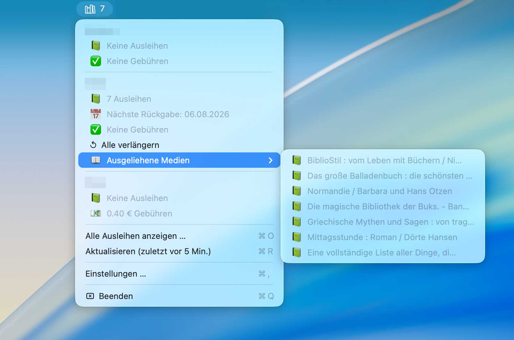
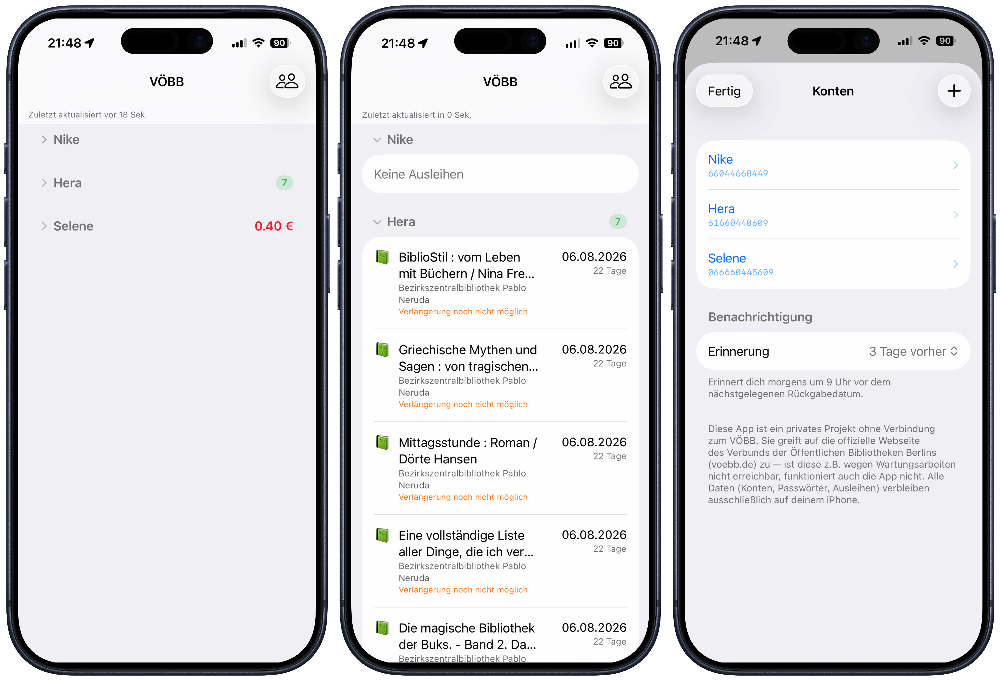

# voebbar

Ausleihen, Fälligkeiten und Gebühren mehrerer Bibliothekskarten des
**[VÖBB](https://www.voebb.de/)** (Verbund der Öffentlichen Bibliotheken Berlins) – mit
Verlängerung auf Knopfdruck. Zwei Apps, ein gemeinsamer Kern (`VOEBBKit`):

- **iOS-App „Voebbar"** (SwiftUI, iOS 16+)
- **macOS-Menüleisten-App** (AppKit, Swift Package Manager, macOS 13+)



## iOS-App „Voebbar"



**Ausleihen im Blick**
- Alle Medien gruppiert nach Konto, sortiert nach Fälligkeit — Abschnitte ein-/ausklappbar
- Ampel-System pro Medium (📕 < 7 Tage · 📙 7–14 Tage · 📗 > 14 Tage); die Ausleihen-Zahl
  eines Kontos färbt sich nach dem dringlichsten Medium
- Gebühren pro Konto direkt in der Kopfzeile
- Beim Start sofort der zuletzt geladene Stand, Aktualisierung läuft im Hintergrund —
  mit Fortschrittsleiste und dauerhaft sichtbarem „Zuletzt aktualisiert"-Hinweis

**Verlängern**
- „Alle verlängern" pro Konto mit Live-Feedback während des Vorgangs
- Zwei-Schritt-Verlängerung: erst Verlängerbarkeit prüfen, dann nur die verlängerbaren
  Medien einreichen — verhindert, dass VÖBB die ganze Aktion abbricht, sobald ein Titel
  gesperrt ist

**Konten & Komfort**
- Beliebig viele Bibliothekskarten, editierbar, mit Passwort-Anzeige per Auge-Knopf
- Ausweisnummer per Barcode-Scan von der Kartenrückseite übernehmen (Kamera)
- Erinnerung vor dem nächsten Rückgabedatum: 1 Tag, 3 Tage oder 1 Woche vorher
  (lokale Benachrichtigung, morgens um 9 Uhr)

**Privatsphäre**
- Passwörter ausschließlich im Schlüsselbund des Geräts, alle weiteren Daten lokal
- Keine Server, kein Tracking, keine Werbung — Details in der
  [Datenschutzerklärung](PRIVACY.md)

```sh
open iOS/VOEBBApp.xcodeproj   # in Xcode öffnen, iPhone wählen, Run
```

## macOS-Menüleisten-App

**Menüleiste & Übersicht**
- Anzahl aller ausgeliehenen Medien als Badge im Menüleisten-Symbol
- Dringlichkeitsindikator: Symbol wechselt, wenn ein Medium in weniger als 7 Tagen fällig ist
- Pro Konto: Anzahl Ausleihen, nächste Fälligkeit (farbcodiert nach Dringlichkeit), offene Gebühren
- Sortierbares Gesamtfenster über alle Konten mit Emoji-Ampel
- Tooltips mit vollständigen Titeln und Bibliotheksnamen; Titel in der Menüleiste werden sinnvoll gekürzt

**Verlängern**
- „Alle verlängern" und „Fällige verlängern (≤ N Tage)" pro Konto, mit derselben
  Zwei-Schritt-Logik wie in der iOS-App

**Mehrere Konten & Refresh**
- Unbegrenzt viele Bibliothekskarten, Passwörter nur im macOS-Schlüsselbund
- Konfigurierbares Auto-Refresh-Intervall und Stale-Prüfung beim Öffnen des Menüs

```sh
./build_app.sh   # erzeugt VOEBBMenu.app
open VOEBBMenu.app
```

Läuft als Accessory-App (`LSUIElement`, kein Dock-Icon). Xcode wird für die Mac-App nicht
benötigt — nur die Xcode-Kommandozeilen-Tools (`xcode-select --install`).

**Erste Schritte:** App starten (beim ersten Start öffnet sich das Einstellungsfenster),
Bibliothekskarte mit Name, Ausweisnummer und Passwort hinzufügen — das Menüleisten-Symbol
zeigt sofort die Ausleihen aller Konten.

## Architektur

Reines HTML-Scraping der aDIS-Weboberfläche (`VOEBBService` / `HTMLParser` in `VOEBBKit`),
kein öffentliches API — gekoppelt an VÖBBs aktuelles Markup. Beide Apps teilen sich Scraper,
Parser, Models und Konten-Verwaltung; die UI ist jeweils nativ. Siehe `CLAUDE.md` für Details.

## Anforderungen

- iOS 16 oder neuer bzw. macOS 13 Ventura oder neuer
- Ein aktiver VÖBB-Bibliotheksausweis
