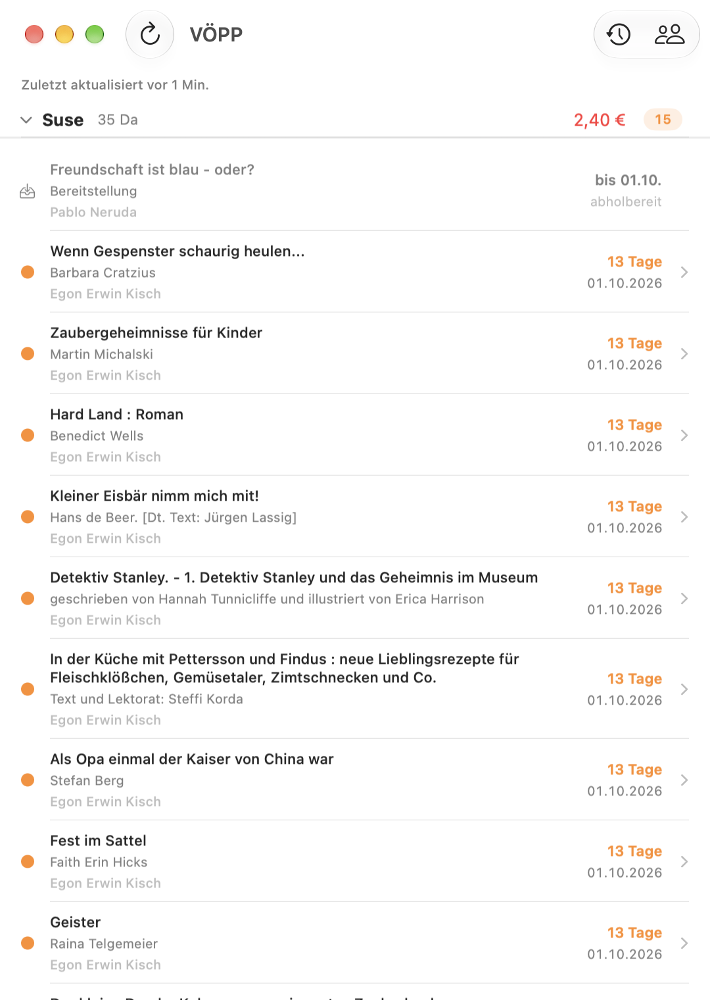

# voebbar

Ausleihen, Fälligkeiten, Bereitstellungen und Gebühren mehrerer Bibliothekskarten des
**[VÖBB](https://www.voebb.de/)** (Verbund der Öffentlichen Bibliotheken Berlins) – mit
Verlängerung auf Knopfdruck. Eine App für iPhone und Mac, ein gemeinsamer Kern (`VOEBBKit`).

## Download

- 🌐 **Webseite:** [voepp.de](https://voepp.de/)
- 📲 **iPhone und 💻 Mac:** [VÖPP im App Store laden](https://apps.apple.com/de/app/voebbar/id6790911430)
  — ein Download für beide Plattformen (iOS 16+, macOS 13+)

## VÖPP

<p>
  
  
  
</p>

VÖPP zeigt dir die Ausleihen deiner Berliner Bibliothekskonten (VÖBB) auf einen Blick – für
beliebig viele Bibliotheksausweise, auf iPhone und Mac. Ein Download für beide Geräte.

**Ausleihen im Blick**
- Alle ausgeliehenen Medien mit Rückgabedatum, sortiert nach Fälligkeit
- Ampel-System: rot = bald fällig, orange = demnächst, grün = entspannt
- Mehrere Konten, etwa die ganze Familie, ein- und ausklappbar
- Pro Konto Gebühren, Abholcode und Hinweis, wenn der Ausweis bald abläuft
- Bereitstellungen: Bestellte Medien, die zur Abholung bereitliegen, mit Abholfrist
- Kurze Bibliotheksnamen, damit die Liste ruhig bleibt

**Verlängern**
- Einzelne Medien oder alle verlängerbaren eines Kontos direkt aus der App
- Vorher wird geprüft, was VÖBB überhaupt verlängern lässt – gesperrte Medien bleiben außen
  vor, der Grund steht in der Detailansicht
- Als verlängert gilt nur, was VÖBB danach mit neuem Datum bestätigt

**Verlauf**
- Welche Medien du wann ausgeliehen und zurückgegeben hast, nach Monat gruppiert, mit Suche
  und Kontofilter
- Als Text teilbar, etwa für Nachrichten oder Notizen
- Entsteht nur auf deinem Gerät und lässt sich abschalten

**Erinnern**
- Mitteilung vor dem nächsten Rückgabedatum: 1 Tag, 3 Tage oder 1 Woche vorher

**Auf dem Mac**
- Fenster-App plus Symbol in der Menüleiste mit den Resttagen des dringlichsten Mediums
- Das Menü fasst jedes Konto in einer Zeile zusammen und aktualisiert stündlich im Hintergrund



**Komfort**
- Zuletzt geladener Stand sofort beim Öffnen, Aktualisierung läuft im Hintergrund
- Ausweisnummer per Barcode-Scan von der Kartenrückseite (iPhone)
- Oberfläche in Deutsch, Englisch, Türkisch, Polnisch und Russisch

**Datenschutz**
- Passwörter liegen ausschließlich im Schlüsselbund deines Geräts, alle weiteren Daten lokal
- Keine Server, kein Tracking, keine Werbung — Details in der
  [Datenschutzerklärung](PRIVACY.md)

**Hinweis:** VÖPP ist ein privates, inoffizielles Projekt ohne Verbindung zum VÖBB oder zur ZLB.
Die App greift auf die offizielle Webseite voebb.de zu. Ist diese etwa wegen Wartungsarbeiten
nicht erreichbar, funktioniert auch die App nicht. Titel und Statusmeldungen stammen von VÖBB
und erscheinen so, wie die Bibliothek sie liefert.

Selbst bauen statt App Store:

```sh
open iOS/VOEBBApp.xcodeproj   # in Xcode öffnen, iPhone oder „My Mac" wählen, Run
```

## Frühere Menüleisten-App (VOEBBMenu)

Vor der Mac-Version von VÖPP gab es eine reine AppKit-Menüleisten-App (`Sources/VOEBBMenu`,
`build_app.sh`). Sie wird **nicht mehr weiterentwickelt**; aktiv gepflegt werden nur noch die
im App Store erhältlichen Versionen für iOS und macOS. Die letzte fertige Fassung liegt als
DMG in den [Releases](https://github.com/noestreich/voebbar/releases), der Code bleibt im
Repository und baut weiterhin mit `./build_app.sh`.

## Architektur

Reines HTML-Scraping der aDIS-Weboberfläche (`VOEBBService` / `HTMLParser` in `VOEBBKit`),
kein öffentliches API — gekoppelt an VÖBBs aktuelles Markup. Die App-Oberfläche ist SwiftUI
mit einem Xcode-Target für beide Plattformen. Regressionstests laufen mit `swift test` auf
anonymisierten Seitenaufnahmen. Siehe `CLAUDE.md` für Details, `CHANGELOG.md` für die
Versionshistorie.

Der Quellcode der Landing Page [voepp.de](https://voepp.de/) liegt unter `website/`.

## Anforderungen

- iOS 16 oder neuer bzw. macOS 13 Ventura oder neuer
- Ein aktiver VÖBB-Bibliotheksausweis
