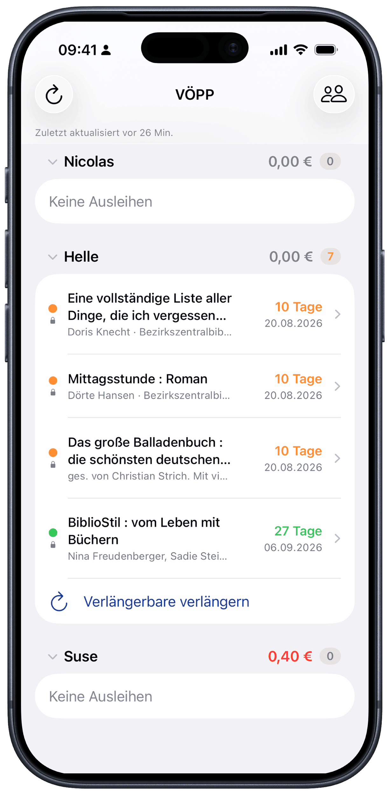
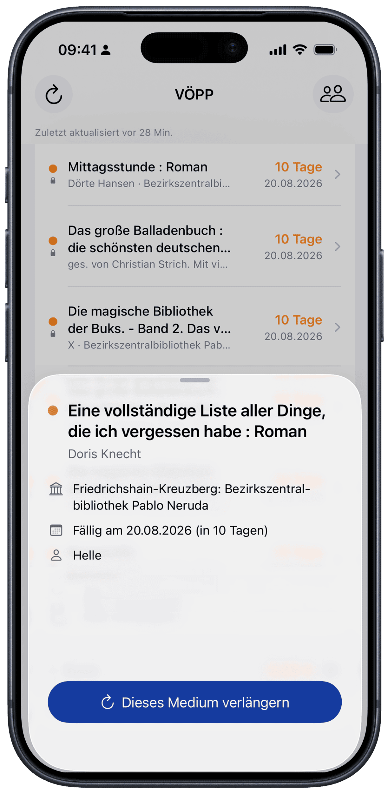
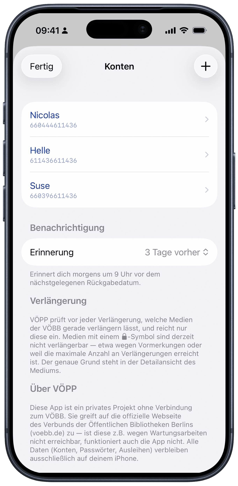

# voebbar

Ausleihen, Fälligkeiten, Bereitstellungen und Gebühren mehrerer Bibliothekskarten des
**[VÖBB](https://www.voebb.de/)** (Verbund der Öffentlichen Bibliotheken Berlins) – mit
Verlängerung auf Knopfdruck. Eine App für iPhone und Mac, ein gemeinsamer Kern (`VOEBBKit`).

## Download

- 🌐 **Webseite:** [voepp.de](https://voepp.de/)
- 📲 **iPhone und 💻 Mac:** [VÖPP im App Store laden](https://apps.apple.com/de/app/voebbar/id6790911430)
  — ein Kauf für beide Plattformen (iOS 16+, macOS 13+)

## VÖPP

<p>
  
  
  
</p>

**Ausleihen im Blick**
- Alle Medien gruppiert nach Konto, sortiert nach Fälligkeit — Abschnitte ein-/ausklappbar
- Ampel-System pro Medium (rot < 7 Tage · orange 7–14 Tage · grün > 14 Tage); die
  Ausleihen-Zahl eines Kontos färbt sich nach dem dringlichsten Medium
- Bereitstellungen (abholbereite Bestellungen) oben in der Kontoliste mit Abholfrist,
  Abholcode und Gebühren direkt in der Kopfzeile, Hinweis bei ablaufendem Ausweis
- Beim Start sofort der zuletzt geladene Stand, Aktualisierung läuft im Hintergrund —
  mit Fortschrittsleiste und dauerhaft sichtbarem „Zuletzt aktualisiert"-Hinweis

**Verlängern**
- Einzelne Medien verlängern: Tipp auf ein Medium öffnet die Detailansicht mit
  Verlängern-Button (auf dem iPhone alternativ per Wisch-Geste nach links)
- „Verlängerbare verlängern" pro Konto mit Live-Feedback während des Vorgangs
- Zwei-Schritt-Verlängerung: erst Verlängerbarkeit prüfen, dann nur die verlängerbaren
  Medien einreichen — verhindert, dass VÖBB die ganze Aktion abbricht, sobald ein Titel
  gesperrt ist. Als verlängert gilt nur, was VÖBB danach mit neuem Fälligkeitsdatum zeigt

**Verlauf**
- Lokaler Ausleih-Verlauf hinter dem Uhr-Symbol: laufende Ausleihen oben, zurückgegebene
  Medien nach Monat gruppiert, mit Suche und Kontofilter — monatsgenau, abschaltbar,
  bleibt auf dem Gerät

**Mac**
- Fenster-App plus Menüleisten-Symbol mit den Resttagen des dringlichsten Mediums; das Menü
  fasst jedes Konto in einer Zeile zusammen und aktualisiert stündlich im Hintergrund

**Konten & Komfort**
- Beliebig viele Bibliothekskarten, editierbar, mit Passwort-Anzeige per Auge-Knopf
- Ausweisnummer per Barcode-Scan von der Kartenrückseite übernehmen (iPhone-Kamera)
- Erinnerung vor dem nächsten Rückgabedatum: 1 Tag, 3 Tage oder 1 Woche vorher
  (lokale Benachrichtigung, morgens um 9 Uhr)

**Privatsphäre**
- Passwörter ausschließlich im Schlüsselbund des Geräts, alle weiteren Daten lokal
- Keine Server, kein Tracking, keine Werbung — Details in der
  [Datenschutzerklärung](PRIVACY.md)

Selbst bauen statt App Store:

```sh
open iOS/VOEBBApp.xcodeproj   # in Xcode öffnen, iPhone oder „My Mac" wählen, Run
```

## Frühere Menüleisten-App (VOEBBMenu)

Vor der Mac-Version von VÖPP gab es eine reine AppKit-Menüleisten-App (`Sources/VOEBBMenu`,
`build_app.sh`). Sie wird **nicht mehr weiterentwickelt**; aktiv gepflegt werden nur noch die
im App Store erhältlichen Versionen für iOS und macOS. Die letzte fertige Fassung liegt als
DMG in den [Releases](https://github.com/noestreich/voebbar/releases), der Code bleibt im
Repository und baut weiterhin mit `./build_app.sh`.

## Architektur

Reines HTML-Scraping der aDIS-Weboberfläche (`VOEBBService` / `HTMLParser` in `VOEBBKit`),
kein öffentliches API — gekoppelt an VÖBBs aktuelles Markup. Die App-Oberfläche ist SwiftUI
mit einem Xcode-Target für beide Plattformen. Regressionstests laufen mit `swift test` auf
anonymisierten Seitenaufnahmen. Siehe `CLAUDE.md` für Details, `CHANGELOG.md` für die
Versionshistorie.

Der Quellcode der Landing Page [voepp.de](https://voepp.de/) liegt unter `website/`.

## Anforderungen

- iOS 16 oder neuer bzw. macOS 13 Ventura oder neuer
- Ein aktiver VÖBB-Bibliotheksausweis
